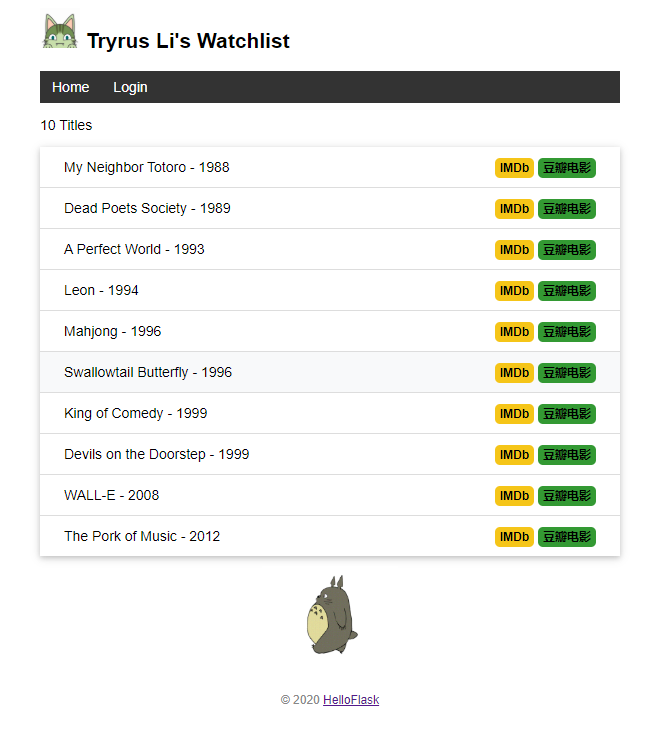

# flask-tutorial

Example application for flask tutorial "[Flask 入门教程](http://helloflask.com/tutorial)".

Demo: http://watchlist.helloflask.com



这是这个demo的每个章节的可运行代码，每一个章节代码都可以单独运行.

## 运行环境
windows10   
python 3.7.4 


## 运行步骤
### windows 环境
```
cd flask-tutorial
pip install virtualenv
virtualenv venv
.\venv\Scripts\activate
pip install -r requirements.txt
cd ./chapter02
flask run
```

### linux 环境
```
cd flask-tutorial
pip install virtualenv
python3 -m venv venv
source venv/bin/activate
pip install -r requirements.txt
cd ./chapter02
flask run
```

## License

This project is licensed under the MIT License (see the
[LICENSE](LICENSE) file for details).
